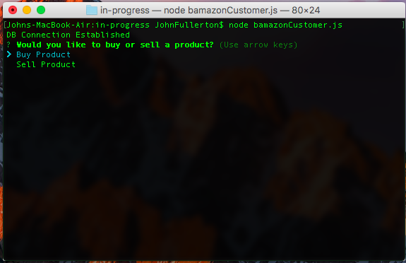
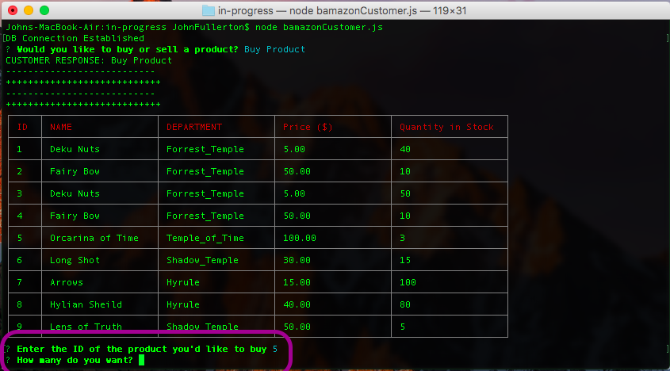

# Bamazon
A command-line store app using npm packages MySQL and Inquirer that lets customers purchase items; managers keep track of items, add stock and add new items; and supervisors view total profits and create departments.

## Table of Contents 

1. [Installation](#installation)
2. [Customer View](#customer)
3. [Manager View](#manager)
4. [Supervisor View](#supervisor)

<a name="installation"></a>
## Installation
1. First clone or download the source code.
```
git clone git@github.com:JSDFullerton/bamazon.git
```
2. Node.js is needed to run this app. Once that is installed, run the following to download dependenices using the Package.JSON file. 
```
npm install
```

<a name="customer"></a>
## Customer View
3. Run the following in a terminal to view the Customer View.
```
node bamazonCustomer.js
```
4. You will be prompted to choose either "buy" or "sell" and item. Choosing to "Buy" will display the available products. 




5. Enter the product ID number for the item to be purchased. Then enter the quanity. 

6. After the order is placed, the product's quantity is checked to see if enough is in stock. If the quantity is not enough, the order is cancelled, otherwise the order is completed. The customer may then continue shopping or exit.

#### bamazonCustomer.js


<a name="manager"></a>
## Manager View
6. Run the following in a terminal to view the Manager View.
```
node bamazonManager.js
```
7. The menu below with different options will be displayed.
```
View Products for Sale
View Low Inventory
Add to Inventory
Add New Product
```
`View Products for Sale` will display table of all the products available in the store.

`View Low Inventory` will display all products with a quantity less than 10.

`Add to Inventory` allows the manager to increase the stock of a item currently in the store. All of the products in the store is displayed. The manager is then prompted to input Item ID number, then the quantity to be added.

`Add New Product` allows the manager to add a new product not previously available to the store. First the name of the product is entered. Next, the manager chooses from a list of available departments. This is followed by the price of the product and then the quantity to be added.

#### bamazonManager.js


